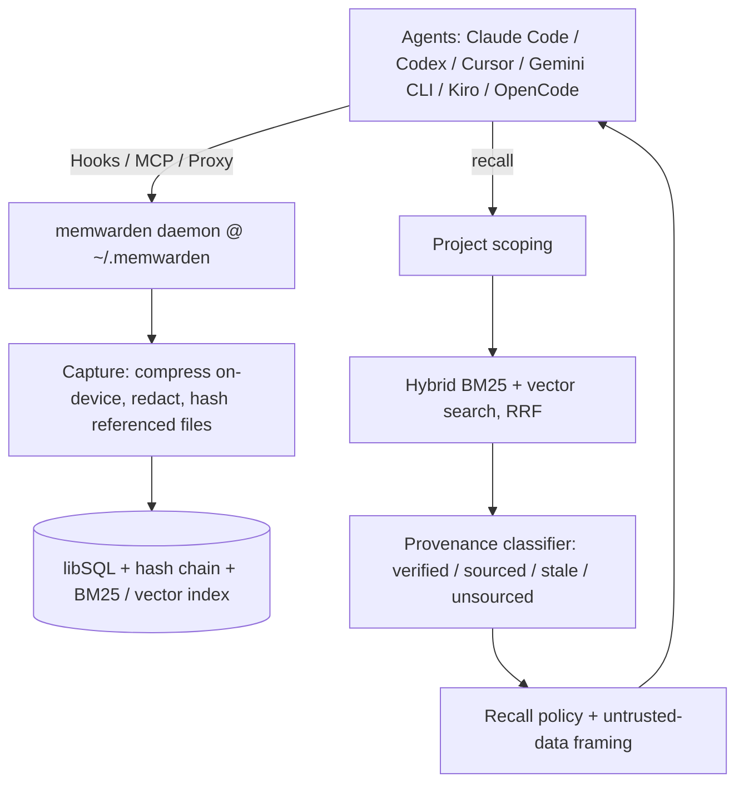

<div align="center">

# 🧠 memwarden

### The memory firewall for AI coding agents.

**Your agent's memory is lying to you. Prove yours isn't.**

memwarden is self-custodied memory for AI coding agents that works across every tool you use —
Claude Code, Codex, Cursor, Gemini CLI, Kiro, OpenCode, and more. The point isn't to remember
*more*. It's that memory whose provenance no longer checks out is **blocked before injection**,
and everything that passes is labeled for exactly what it is — verified, sourced, or unsourced.

`memory firewall` · `verified recall` · `tamper-evident` · `self-custodied` · `cross-tool` · `no API key`

[](https://www.npmjs.com/package/memwarden)
[](LICENSE)
[](package.json)

```bash
npx memwarden audit <your-memory-store>    # zero-install: audit what you already have
npm install -g memwarden && memwarden up   # persistent: wire every tool
```

</div>

---

## The problem: is the memory still true?

Most memory layers are built to *remember more.* memwarden is built around a harder question:
**is the memory still true?**

The failure mode that hurts isn't forgetting — it's **confidently wrong recall**. A stored fact
silently goes stale: it points at code you've since changed or deleted, and the agent injects it
with full confidence anyway. OWASP added Memory Poisoning (ASI06) to its 2026 Agentic Top 10, yet
memory still tends to store everything and trust everything.

memwarden flips the default: **memory is untrusted until its source still checks out.**

## The differentiator: source-file hashes as ground truth

A coding agent has something general-purpose memory doesn't: the repository on disk is the source
of truth. When memwarden captures a code-backed memory, it records a SHA-256 content hash for each
referenced file. On recall it re-hashes the live file and compares. If the file is gone or its
content moved, the memory is provably stale — not by heuristic, by hash. That is the lever the
whole firewall stands on, and it is only possible because the repo can settle the question.

Nobody with traction ties memory validity to source-file content hashes. That is the seat
memwarden takes.

## Quick start

```bash
npm install -g memwarden
memwarden up
```

`up` installs an on-device embedding runtime (transformers.js + all-MiniLM-L6-v2, one time, into
`~/.memwarden/runtime`; skip with `--lexical-only`), starts a self-healing daemon (one brain at
`~/.memwarden`, registered as a macOS LaunchAgent / Linux systemd `--user` service), detects your
installed tools and writes the memwarden MCP server + native lifecycle hooks into each, and ends by
printing `memwarden status` with concrete next steps. Everything runs on-device; nothing leaves the
machine. `memwarden down --all` reverses all of it (only entries memwarden wrote); `--data` deletes
the brain.

Run it from a stable install (global as above, or project-local). Running from `npx`'s transient
cache is refused, because npm later deletes that cache and the wiring would break. (The zero-install
`npx memwarden audit <store>` needs none of this.)

## Verified Recall — the four trust states

Every memory is classified against the live repo:

- **verified** — a captured source-file hash still matches the file on disk (code-backed and
  current). Only content-hash-confirmed records earn this label.
- **sourced** — has a source (a command, or files present but not hashable) but no content hash to
  re-check. Allowed, labeled, not content-verified.
- **stale** — a referenced file was deleted, or its content changed since capture.
- **unsourced** — no provenance at all: no files, no command, not user-confirmed.

**The firewall blocks `stale` before injection. It does not block `unsourced`** — unsourced means
*unverified*, not *dangerous*, so it stays available for explicit lookups. What passes is
firewall-passing, trust-labeled memory — never laundered into one "verified" pile.

Two policies. `balanced` (the default) **blocks stale memory and keeps the rest — sourced and
unsourced — each labeled**; it means "not detected stale," not "proven safe." For hostile-repo or
hostile-tool-output threat models, `MEMWARDEN_RECALL_POLICY=verified-only` raises the floor so
nothing that cannot prove itself against the live repo is ever auto-injected. Either way, recalled
content is framed and delimited as untrusted **data** (`<memwarden-memory>` markers, with any
embedded delimiters defanged so stored text can't break out of the block).

## The shareable audit: `memwarden doctor`

Point it at a repo and get a red/yellow/green report — the same check as a report, plus
conservative conflict detection:

```bash
memwarden doctor .

  VERIFIED:   8 memories (code-backed, current)
  SOURCED:    3 memories (sourced, not content-verified)
  STALE:      2 memories reference files that changed/deleted
  UNSOURCED:  1 memory has no evidence
  CONFLICTS:  1 possible contradiction

  [stale]  Edit (obs_…) — references files that no longer match (changed: src/legacy.ts)
```

```bash
memwarden why obs_abc123        # explain one memory: verified / sourced / stale / refused
memwarden doctor . --fix-stale  # forget every stale memory (add --erase to null oplog payloads)
```

Or audit the memory you already have, zero-install, read-only:

```bash
npx memwarden audit ~/.claude-mem/claude-mem.db --root ~/code/my-repo   # any SQLite store
npx memwarden audit CLAUDE.md                                           # a CLAUDE.md / rules pile
npx memwarden audit mem0-export.json --root ~/code/my-repo              # a Mem0-style JSON export
```

It classifies every memory (MISSING / DRIFTED / PRESENT / UNANCHORED) and emits a deterministic
action plan; `--html [out.html]` renders a self-contained shareable page. Every red and yellow
memory is one your agent would have injected with full confidence.

## Déjà Fix — never solve the same error twice, across every tool

memwarden is the one process that sees **every** agent's sessions, so when any agent resolves an
error it captures `{error signature → root cause + fix}` with provenance hashes. When any agent
later hits a matching error, the fix is surfaced automatically — but only if its referenced files
still hash-match. It is cross-agent, project-scoped, and safe by construction (it reuses Verified
Recall, so file drift auto-suppresses a stale fix). The hook auto-injects only `verified current`
fixes; the rest stay available via `memwarden dejafix lookup` and the `dejafix_lookup` MCP tool.

```bash
npm test 2>&1 | memwarden dejafix lookup   # pipe any failing command's output straight in
```

## Compatibility

There are three ways memory reaches a tool, and `memwarden up` wires whichever each supports.
"native hooks everywhere" would be a lie — hosts genuinely differ, so here is the honest matrix:

| Tool | Capture / recall | How memory flows | Explicit recall |
| --- | --- | --- | --- |
| **Claude Code** | automatic (hooks) | session-start injects, post-tool-use + prompt capture, session-end handoff | `/mcp__memwarden__recall <query>` |
| **Cursor** | automatic (hooks) | same, via Cursor's hook dialect | ask it to call `memory_resume` (MCP) |
| **Gemini CLI** | automatic (hooks) | same, via Gemini's hook dialect | ask it to call `memory_resume` (MCP) |
| **Codex** | automatic after `/hooks` trust | hooks fire once trusted; `Stop` refreshes the handoff each turn | ask it to call `memory_resume` (MCP) |
| **Kiro** | best-effort (per custom agent) | capture works; Déjà Fix can't auto-inject (ignores post-tool-use stdout) | ask it to call `memory_resume` (MCP) |
| **OpenCode** | best-effort (plugin) | capture is mechanical; injection/prompt ride an undocumented plugin path | `memory_resume` (MCP) |
| **Antigravity** | manual (MCP only) | no hook injection; MCP tools available | ask it to call `memory_resume` (MCP) |
| **OpenClaw** | manual (MCP + `AGENTS.md`) | no hook system; soft standing instruction | ask it to call `memory_resume` (MCP) |
| **Ollama / LM Studio / any OpenAI base URL** | automatic (proxy) | point the base URL at `:3141`; every turn recalled + captured | n/a (automatic) |

Legend: **automatic** = mechanical, the agent can't forget; **best-effort** = works but with the
noted caveat; **manual MCP** = no auto-injection, ask the agent to call `memory_resume`;
**proxy** = mechanical at the API boundary where you control the model endpoint.

`memory_resume` (verified recall of this project) is the portable entry point on every MCP host.
Only Claude Code surfaces the `recall` prompt as the `/mcp__memwarden__recall` slash command;
elsewhere, ask the agent to call `memory_resume`. Where hooks are automatic, recall arrives on
its own at session start — you don't have to ask.

`memwarden status` shows, per tool, **detected** / **configured** / **live** (a hook actually
reached the daemon) — so "it works across tools" is something you can check, not take on faith.

## Architecture



Capture compresses raw tool output (no LLM), redacts private data, and hashes referenced files.
Recall runs hybrid BM25 + vector search (RRF) scoped by canonical path, classifies each hit against
the live repo, applies the recall policy, and frames what passes as untrusted data. Full detail,
including the tamper-evidence and erasure model, is in [docs/architecture.md](docs/architecture.md).

## Try it in 60 seconds

```bash
npm run demo:trust      # Verified Recall refusing a stale memory, step by step
npm run demo:firewall   # the full firewall arc against a real daemon, ending in byte-scan-proven erasure
```

`demo:firewall` boots a real daemon and ends by byte-scanning the store to prove the erased content
is physically gone. `demo:trust` captures a code-backed memory, changes the file, and proves
`safe_only` recall refuses the now-stale memory while plain search can still find it.

## Tamper-evident, honestly

Every write lands in an append-only, SHA-256 hash-chained oplog; `memory_verify` recomputes the
chain, so an edit or reorder of any past entry breaks it. It is **tamper-evident, not
tamper-proof** — no signing, and tail-truncation is undetectable. `memwarden forget <id>` returns a
receipt citing the oplog entries; `--erase` nulls the content in place (the chain still verifies
because entries commit to the *hash* of their content) and cascades into derived records, with a
residual scan that refuses to claim `contentErased: true` while a copy survives. Full model:
[docs/architecture.md](docs/architecture.md).

## MCP tools

| Tool | What it does |
| --- | --- |
| `memory_resume` | Verified recall of this project across all past sessions and tools |
| `memory_search` | Hybrid semantic + keyword search (unfiltered, for explicit lookups) |
| `memory_remember` | Save a memory explicitly |
| `memory_verify` | Confirm the oplog hash chain is intact (tamper-evident; not signed) |
| `memory_stats` | Live counts, compression ratio, token reduction, latency |

Plus the `recall` MCP prompt, surfaced in Claude Code as `/mcp__memwarden__recall <query>`.

## More

- **[docs/architecture.md](docs/architecture.md)** — data-flow diagram, the pipeline, tamper-evidence + erasure in full, source layout
- **[docs/benchmarks.md](docs/benchmarks.md)** — retrieval quality, vector backends (~125× native), the firewall eval
- **[docs/configuration.md](docs/configuration.md)** — every env var, per-project switches, the proxy
- **[docs/limitations.md](docs/limitations.md)** — what memwarden does NOT do, honestly
- **[SECURITY.md](SECURITY.md)** · **[CONTRIBUTING.md](CONTRIBUTING.md)** · **[CHANGELOG.md](CHANGELOG.md)**

## Portability

```bash
memwarden export brain.json   # on machine A
memwarden import brain.json   # on machine B
```

Your memory is a portable JSON Brain Bundle — no cloud, no vendor in the loop. When the next memory
startup gets acquired or sunset, you keep your brain.

## License

Apache-2.0
