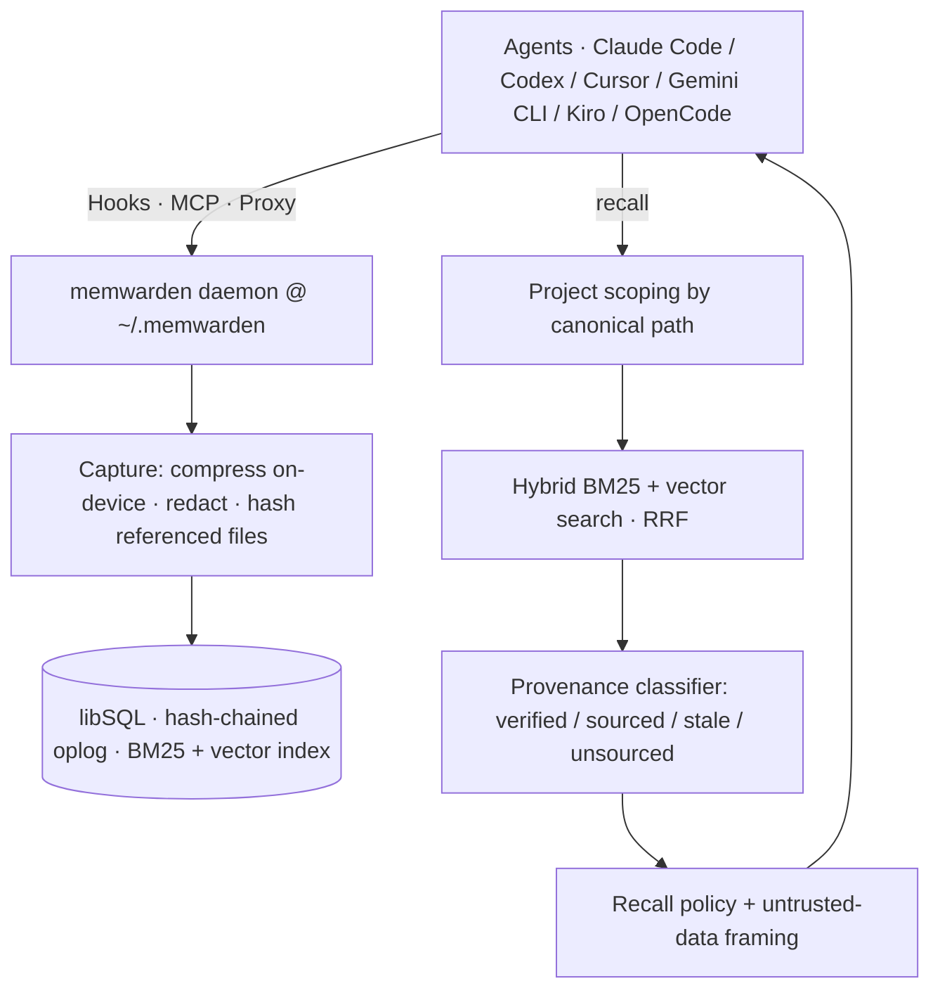

<div align="center">


### The memory firewall for AI coding agents

**Your agent's memory is lying to you. Prove yours isn't.**

Memory whose source no longer checks out is **blocked before it reaches the model** - and everything that passes is labeled for exactly what it is.

[](https://www.npmjs.com/package/memwarden)
[](https://github.com/saiyam1814/memwarden/actions)
[](LICENSE)
[](package.json)
[](https://github.com/saiyam1814/memwarden)

```bash
npx memwarden audit <your-memory-store>     # zero-install: audit the memory you already have
npm install -g memwarden && memwarden up    # persistent: wire every agent, one command
```

[Quick start](#-quick-start) · [Why](#-why-memwarden) · [Trust states](#-the-four-trust-states) · [Compatibility](#-compatibility) · [How it works](#-how-it-works) · [Docs](#-docs)

</div>

---

memwarden is **self-custodied, verified memory** shared across every coding agent you use - Claude
Code, Codex, Cursor, Gemini CLI, Kiro, OpenCode, and more. The point isn't to remember *more*. It's
that a coding agent can settle a question general-purpose memory can't: **is this memory still true?**
Every code-backed memory is tied to a SHA-256 hash of the files it references; on recall the live repo
is re-hashed, and anything that no longer checks out is refused before the model ever sees it.

## 🚀 Quick start

```bash
npm install -g memwarden
memwarden up
```

`memwarden up` is the whole setup. It:

- starts a **self-healing daemon** - one brain at `~/.memwarden`, registered as a launchd / systemd service
- installs **on-device embeddings** (all-MiniLM-L6-v2) so recall is semantic from day one - nothing leaves the machine
- writes the **MCP server + native hooks** into every installed tool, in each tool's own config, without clobbering anything
- ends by printing `memwarden status` so you can see it's flowing

`memwarden down --all` reverses everything it wrote; `--data` deletes the brain. Prefer to try before you install? `npx memwarden audit <store>` needs no daemon and no setup.

## 🤔 Why memwarden

The failure mode that hurts isn't forgetting - it's **confidently wrong recall**. A stored fact goes
stale, points at code you've since changed or deleted, and the agent injects it with full confidence
anyway. OWASP added Memory Poisoning (ASI06) to its 2026 Agentic Top 10, yet memory layers still tend
to store everything and trust everything.

memwarden flips the default: **memory is untrusted until its source still checks out.**

| | Typical memory layer | memwarden |
| --- | --- | --- |
| Goal | remember *more* | remember what's *still true* |
| Stale memory | injected, confidently | **blocked before the model sees it** |
| What reaches the model | one undifferentiated pile | labeled `verified` / `sourced` / `unsourced` |
| Ground truth | none | **source-file content hashes** |
| Hosting | usually a vendor cloud | **local-first, self-custodied, portable** |

## ✨ What you get

| | |
| --- | --- |
| 🩺 **Verified Recall** | Memory firewalled before it reaches a model. Stale memory is never injected. |
| 🔎 **`memwarden doctor`** | Red/yellow/green trust audit of any store - a shareable artifact you can point at your existing memory. |
| ♻️ **Déjà Fix** | A fix learned in one agent auto-surfaces in another - but only while its files still hash-match. |
| 🔗 **Tamper-evident** | Append-only SHA-256 hash-chained oplog; `memory_verify` recomputes it. Erasure with offline-checkable receipts. |
| 🧩 **Cross-tool** | Native hooks, MCP, and a proxy wire 8+ agents to one brain - mechanically, no instruction files. |
| ⚡ **Fast** | Optional native turbovec backend: ~125× faster search at 10K vectors, zero recall drop. |
| 🔒 **Self-custodied** | Lives at `~/.memwarden`, on-device, two runtime deps, no cloud, no API key. `export`/`import` to move it. |

## 🚦 The four trust states

Every memory is classified against the live repo before it can reach a model:

| State | Meaning | Firewall |
| --- | --- | --- |
| 🟢 `verified` | a captured source-file hash still matches the file on disk - code-backed and current | **injected** (only content-hash-confirmed memory earns this) |
| 🔵 `sourced` | has a source (command, or files present but not hashable), no content hash to re-check | injected, **labeled** |
| 🟠 `stale` | a referenced file was deleted or its content changed since capture | **blocked** |
| ⚪ `unsourced` | no provenance at all | kept for explicit lookups, **labeled** (unverified ≠ dangerous) |

Two policies: **`balanced`** (default) blocks stale and keeps the rest, each labeled - it means "not
detected stale," not "proven safe." **`verified-only`** raises the floor so only hash-verified memory is
ever auto-injected (for hostile-repo threat models). Either way, recalled content is framed and
delimited as untrusted **data**, with embedded delimiters defanged so stored text can't break out.

```console
$ memwarden doctor .

  VERIFIED:   8 memories (code-backed, current)
  SOURCED:    3 memories (sourced, not content-verified)
  STALE:      2 memories reference files that changed/deleted
  UNSOURCED:  1 memory has no evidence

  [stale]  Edit (obs_…) - references files that no longer match (changed: src/legacy.ts)
```

```bash
memwarden why <id>              # explain one memory's verdict
memwarden doctor . --fix-stale  # forget every stale memory
```

## 🔌 Compatibility

Three ways memory reaches a tool; `memwarden up` wires whichever each supports. No "native hooks
everywhere" hand-waving - hosts genuinely differ, so here's the honest matrix:

| Tool | Capture / recall | Explicit recall |
| --- | --- | --- |
| **Claude Code** | 🟢 automatic (hooks) | `/mcp__memwarden__recall` |
| **Cursor** | 🟢 automatic (hooks) | call `memory_resume` |
| **Gemini CLI** | 🟢 automatic (hooks) | call `memory_resume` |
| **Codex** | 🟢 automatic (after `/hooks` trust) | call `memory_resume` |
| **Kiro** | 🟡 best-effort (per custom agent) | call `memory_resume` |
| **OpenCode** | 🟡 best-effort (plugin) | call `memory_resume` |
| **Antigravity · OpenClaw** | ⚪ manual (MCP only) | call `memory_resume` |
| **Ollama · LM Studio · any OpenAI URL** | 🟢 automatic (proxy `:3141`) | n/a - automatic |

Where hooks are automatic, recall arrives on its own at session start. `memwarden status` shows
**detected / configured / live** per tool - so "it works across tools" is something you can check.

## 🛠️ How it works



Capture compresses raw tool output (no LLM), redacts secrets, and hashes referenced files. Recall runs
hybrid BM25 + vector search scoped by canonical path, classifies each hit against the live repo, applies
the policy, and frames what passes as untrusted data. Full detail - including the tamper-evidence and
verifiable-erasure model - is in **[docs/architecture.md](docs/architecture.md)**.

## ⌨️ Command cheat sheet

| Command | What it does |
| --- | --- |
| `memwarden up` / `down` | wire every tool + daemon / reverse it |
| `memwarden status` | daemon, backend, and per-tool detected/configured/live |
| `memwarden doctor .` | trust audit of this project (`--fix-stale`, `--erase`) |
| `memwarden audit <store>` | audit a foreign store (claude-mem, CLAUDE.md, Mem0) - no daemon |
| `memwarden why <id>` | explain one memory's trust verdict |
| `memwarden forget <id>` | delete with a tamper-evident receipt (`--erase` scrubs the oplog) |
| `memwarden export / import` | move your brain between machines |
| `npm run demo:firewall` | the full firewall arc against a real daemon, byte-scan-proven erasure |

## 📚 Docs

- **[Architecture](docs/architecture.md)** - data flow, the pipeline, tamper-evidence + erasure in full, source layout
- **[Benchmarks](docs/benchmarks.md)** - retrieval quality, vector backends (~125× native), the 8-gate firewall eval
- **[Configuration](docs/configuration.md)** - every env var, per-project switches, the proxy
- **[Limitations](docs/limitations.md)** - what memwarden does *not* do, honestly
- **[Security](SECURITY.md)** · **[Contributing](CONTRIBUTING.md)** · **[Changelog](CHANGELOG.md)**

## License

Apache-2.0 · self-custodied by design - your memory is a portable Brain Bundle, no vendor in the loop.

<div align="center"><sub>a <a href="https://kubesimplify.com">Kubesimplify</a> project</sub></div>
