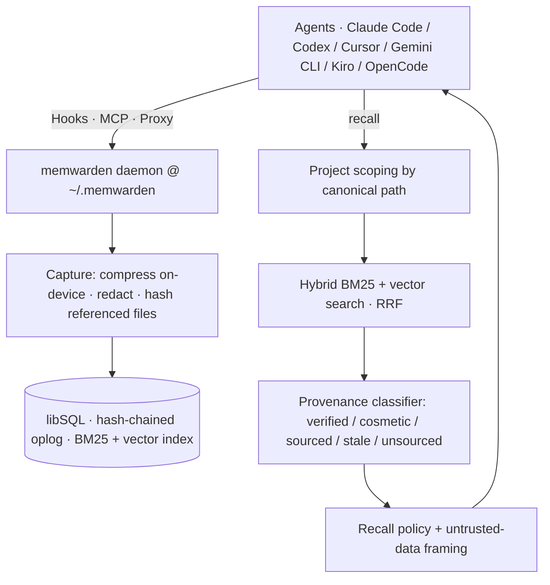

<div align="center">


### The memory firewall for AI coding agents

**Code changes. Stored memory can outlive its source. Expose the drift.**

Memory whose source no longer checks out is **blocked before it reaches the model** - and everything that passes is labeled for exactly what it is.

[](https://www.npmjs.com/package/memwarden)
[](https://github.com/saiyam1814/memwarden/actions)
[](LICENSE)
[](package.json)
[](https://github.com/saiyam1814/memwarden)

```bash
npx memwarden audit <your-memory-store>     # zero-install: audit the memory you already have
npm install -g memwarden && memwarden up    # persistent: wire every agent, one command
```

[Quick start](#-quick-start) · [Why](#-why-memwarden) · [Trust states](#-the-five-trust-states) · [Compatibility](#-compatibility) · [How it works](#-how-it-works) · [Docs](#-docs)

</div>

---

memwarden is **self-custodied, verified memory** shared across every coding agent you use - Claude
Code, Codex, Cursor, Gemini CLI, Kiro, OpenCode, and more. The point isn't to remember *more*. It's
that a coding agent can settle a question general-purpose memory can't: **does this memory's recorded
source still match?** Every code-backed memory is tied to a SHA-256 hash of the files it references;
on recall the live repo is re-hashed, and anything that no longer checks out is refused before the
model ever sees it.

## 🚀 Quick start

```bash
npm install -g memwarden
memwarden up
```

`memwarden up` is the whole setup. It:

- starts a **self-healing daemon** - one brain at `~/.memwarden`, registered as a launchd / systemd service
- installs **on-device embeddings** (all-MiniLM-L6-v2) so recall is semantic from day one - nothing leaves the machine
- writes the **MCP server + native hooks** into every installed tool, in each tool's own config, without clobbering anything
- ends by printing `memwarden status` so you can see it's flowing

`memwarden down --all` reverses everything it wrote; `--data` deletes the brain. Prefer to try before you install? `npx memwarden audit <store>` needs no daemon and no setup.

**Already have memory elsewhere?** `memwarden adopt <store>` seeds an existing CLAUDE.md, claude-mem db, or Mem0 export into the brain so it flows across your agents. Adopted memory carries no capture-time hashes, so it is labeled `sourced` (drift-aware but not content-`verified`) - honest by construction; only memory captured going forward earns `verified`. Run `memwarden audit <store>` first to preview exactly what you are adopting.

## 🤔 Why memwarden

The failure mode that hurts isn't forgetting - it's **unexamined source drift**. A stored fact can
outlive the code it points at, leaving evidence that needs revalidation. That drift exposure is not
proof the memory is wrong; it is the risk unchecked layers carry when they inject without looking.
OWASP added Memory Poisoning (ASI06) to its 2026 Agentic Top 10, yet memory layers still tend to store
everything and trust everything.

memwarden flips the default: **memory is untrusted until its source still checks out.**

| | Typical memory layer | memwarden |
| --- | --- | --- |
| Goal | remember *more* | revalidate source before recall |
| Source drift | not checked | **blocked before the model sees it** |
| What reaches the model | one undifferentiated pile | labeled `verified` / `sourced` / `unsourced` |
| Revalidation evidence | none | **source-file content hashes** |
| Hosting | usually a vendor cloud | **local-first, self-custodied, portable** |

## ✨ What you get

| | |
| --- | --- |
| 🩺 **Verified Recall** | Memory firewalled before it reaches a model. Stale memory is never injected. |
| 🔎 **`memwarden doctor`** | Red/yellow/green trust audit of any store - a shareable artifact you can point at your existing memory. |
| ♻️ **Déjà Fix** | A fix learned in one agent auto-surfaces in another - but only while its files still hash-match. |
| 🔗 **Tamper-evident** | Append-only SHA-256 hash-chained oplog; `memory_verify` recomputes it. Erasure with offline-checkable receipts. |
| 🧩 **Cross-tool** | Native hooks, MCP, and a proxy wire 8+ agents to one brain - mechanically, no instruction files. |
| ⚡ **Fast** | Optional native turbovec backend: ~125× faster search at 10K vectors, zero recall drop. |
| 📌 **Portable proof** | `canon push` commits verified memory to your repo; **any clone re-verifies it locally** - no server, no account. A CI gate fails the PR when a memory references code the PR changed. |
| 🔒 **Self-custodied** | Lives at `~/.memwarden`, on-device, two runtime deps, no cloud, no API key. `export`/`import` to move it. |

## 🚦 The five trust states

Every search hit is classified against its source before an inclusion policy decides whether it can reach a model:

| State | Meaning | Firewall |
| --- | --- | --- |
| 🟢 `verified` | captured raw bytes still match exactly - code-backed and current | **injected** (only byte-identical memory earns this label) |
| `cosmetic` / `source-cosmetic` | captured normalized text still matches; only CRLF/LF or trailing whitespace differs | **current and injected**, but never mislabeled byte-verified |
| 🔵 `sourced` | has a source (command, or files present but not hashable), no content hash to re-check | injected, **labeled** |
| 🟠 `stale` / `source-drifted` | a referenced file was deleted or its content changed since capture | **blocked from current recall**; explicit history only |
| ⚪ `unsourced` | no provenance at all | included by balanced recall, always **labeled** (unverified ≠ dangerous) |

Classification always runs; policy controls **inclusion**, not whether a result gets a verdict. Every
`full`, `compact`, and `narrative` search result carries `trust`, `source_status`, capture time, and an
evidence summary. **`balanced`** (default) current recall blocks source-drifted/unverifiable records and
keeps verified, cosmetic-current, sourced, and unsourced records labeled - "not detected stale" is not
"proven safe." **`verified-only`** raises the current/automatic recall floor to raw-verified or
normalized-content-current memory (for hostile-repo threat models); the label still distinguishes them.
`memwarden status` reports total **memories served** plus the nonzero
verified/cosmetic/sourced/unsourced breakdown; old aggregate-only counters remain explicitly
legacy/unclassified. The [versioned JSON contract](docs/configuration.md#firewall-activity-schema) is
shared by `/stats` and `status --json`.

MCP `memory_search` is project-scoped with `mode: "current"` by default. `mode: "historical"` deliberately
returns only source-drifted or superseded records, framed with capture time and evidence;
`mode: "all"` (or `include_drifted: true`) is the explicit current+history view. `all_projects: true`
checks each hit against its own known checkout; if that checkout is unavailable, the hit is labeled
`unverifiable` and is not included as current context. Historical/all inspection bypasses the current
inclusion floor, never classification or labels. Recalled content is always framed and delimited as
untrusted **data**, with embedded delimiters defanged so stored text can't break out.

```console
$ memwarden doctor .

  VERIFIED:   8 memories (code-backed, current)
  SOURCED:    3 memories (sourced, not content-verified)
  STALE:      2 memories reference files that changed/deleted
  UNSOURCED:  1 memory has no evidence

  [stale]  Edit (obs_…) - references files that no longer match (changed: src/legacy.ts)
```

```bash
memwarden why <id>              # explain one memory's verdict
memwarden doctor . --fix-stale  # forget every stale memory
```

## 🔌 Compatibility

Three ways memory reaches a tool; `memwarden up` wires whichever each supports. No "native hooks
everywhere" hand-waving - hosts genuinely differ, so here's the honest matrix:

| Tool | Capture / recall | Explicit recall |
| --- | --- | --- |
| **Claude Code** | 🟢 automatic (hooks) | `/mcp__memwarden__recall` |
| **Cursor** | 🟢 automatic (hooks) | call `memory_resume` |
| **Gemini CLI** | 🟢 automatic (hooks) | call `memory_resume` |
| **Codex** | 🟢 automatic (after `/hooks` trust) | call `memory_resume` |
| **Kiro** | 🟡 best-effort (per custom agent) | call `memory_resume` |
| **OpenCode** | 🟡 best-effort (plugin) | call `memory_resume` |
| **Antigravity · OpenClaw** | ⚪ manual (MCP only) | call `memory_resume` |
| **Ollama · LM Studio · any OpenAI URL** | 🟢 automatic (proxy `:3141`) | n/a - automatic |

Where hooks are automatic, recall arrives on its own at session start. `memwarden status` shows
**detected / configured / live** per tool - so "it works across tools" is something you can check.

## 🛠️ How it works


```mermaid
flowchart TB
  A["Agents · Claude Code / Codex / Cursor / Gemini CLI / Kiro / OpenCode"]
  A -->|Hooks · MCP · Proxy| D["memwarden daemon @ ~/.memwarden"]
  D --> C["Capture: compress on-device · redact · hash referenced files"]
  C --> S[("libSQL · hash-chained oplog · BM25 + vector index")]
  A -->|recall| P[Project scoping by canonical path]
  P --> H[Hybrid BM25 + vector search · RRF]
  H --> V["Provenance classifier: verified / cosmetic / sourced / stale / unsourced"]
  V --> R[Recall policy + untrusted-data framing]
  R --> A
```

Capture compresses raw tool output (no LLM), redacts secrets, and stores raw plus normalized text
commitments for referenced files. Recall runs hybrid BM25 + vector search scoped by canonical path,
classifies each hit against the live repo, applies the policy, and frames what passes as untrusted data. Full detail - including the tamper-evidence and
verifiable-erasure model - is in **[docs/architecture.md](docs/architecture.md)**.

## ⌨️ Command cheat sheet

| Command | What it does |
| --- | --- |
| `memwarden up` / `down` | wire every tool + daemon / reverse it |
| `memwarden status` | daemon, backend, and per-tool detected/configured/live |
| `memwarden doctor .` | trust audit of this project (`--fix-stale`, `--erase`) |
| `memwarden audit <store>` | audit a foreign store (claude-mem, CLAUDE.md, Mem0) - no daemon |
| `memwarden adopt <store>` | seed a foreign store into the brain (labeled `sourced`, never `verified`) |
| `memwarden why <id>` | explain one memory's trust verdict |
| `memwarden canon push / verify / pull` | **git-native verified memory**: promote to `.memwarden/canon.jsonl`, re-verify it in any checkout, load it here |
| `memwarden canon reanchor` | assert drifted records still hold, re-hashed against this checkout (recorded as human attestation) |
| `memwarden fleet status` | which agents are active in this project right now, and what each is touching |
| `memwarden forget <id>` | delete with a tamper-evident receipt (`--erase` scrubs the oplog) |
| `memwarden compact --prune-history` | reclaim disk by dropping superseded payload copies; the hash chain still verifies |
| `memwarden export / import` | move your brain between machines |
| `npm run demo:firewall` | the full firewall arc against a real daemon, byte-scan-proven erasure |

## Beta release gate

`npm run test:packed` builds the exact `npm pack` artifact, installs it into a clean project, and
runs the public CLI, MCP stdio adapter, real daemon, authenticated HTTP API, and on-disk store with a
temporary `HOME`, data directory, ports, git repository/worktree, and fixture agent configs. It proves:

- install/status plus clean custom-port daemon start, restart, recovery, and shutdown;
- hook capture, claim-lossless consolidation, MCP recall, current refusal, and labeled history;
- durable manual saves across a real retention sweep and audit-to-adopt stale quarantine behavior;
- Canon push, secret blocking, commit/worktree portability, fresh-brain pull, and fail-closed drift;
- forged delimiter containment and erase/compact byte-scan cleanup.

`npm run test:packed:smoke` is the fast PR subset on Linux, macOS, and Windows. The full release gate
runs on Linux and macOS before publish; Linux additionally side-loads and exercises the TypeScript
vector runtime, then the native backend when `@memwarden/turbovec` is available for that runner.
Daemon and command logs are printed and archived on failure. Windows is intentionally the supported
smoke subset, not a claim that service-manager or every full-release journey is implemented there.

The gate proves today's conservative source-validity contract. Versioned claim supersession,
fine-grained revalidation anchors, and richer daily memory management remain follow-up work in
issues #61, #62, and #63 rather than hidden beta claims.

## 📚 Docs

- **[Architecture](docs/architecture.md)** - data flow, the pipeline, tamper-evidence + erasure in full, source layout
- **[Benchmarks](docs/benchmarks.md)** - retrieval quality, vector backends (~125× native), the 8-gate firewall eval
- **[Configuration](docs/configuration.md)** - every env var, per-project switches, the proxy
- **[Limitations](docs/limitations.md)** - what memwarden does *not* do, honestly
- **[Fleet mode (roadmap)](docs/fleet-mode.md)** - verified shared memory + conflict firewall for agent swarms ([epic #24](https://github.com/saiyam1814/memwarden/issues/24))
- **[Security](SECURITY.md)** · **[Contributing](CONTRIBUTING.md)** · **[Changelog](CHANGELOG.md)**

## License

Apache-2.0 · self-custodied by design - your memory is a portable Brain Bundle, no vendor in the loop.

<div align="center"><sub>a <a href="https://kubesimplify.com">Kubesimplify</a> project</sub></div>
