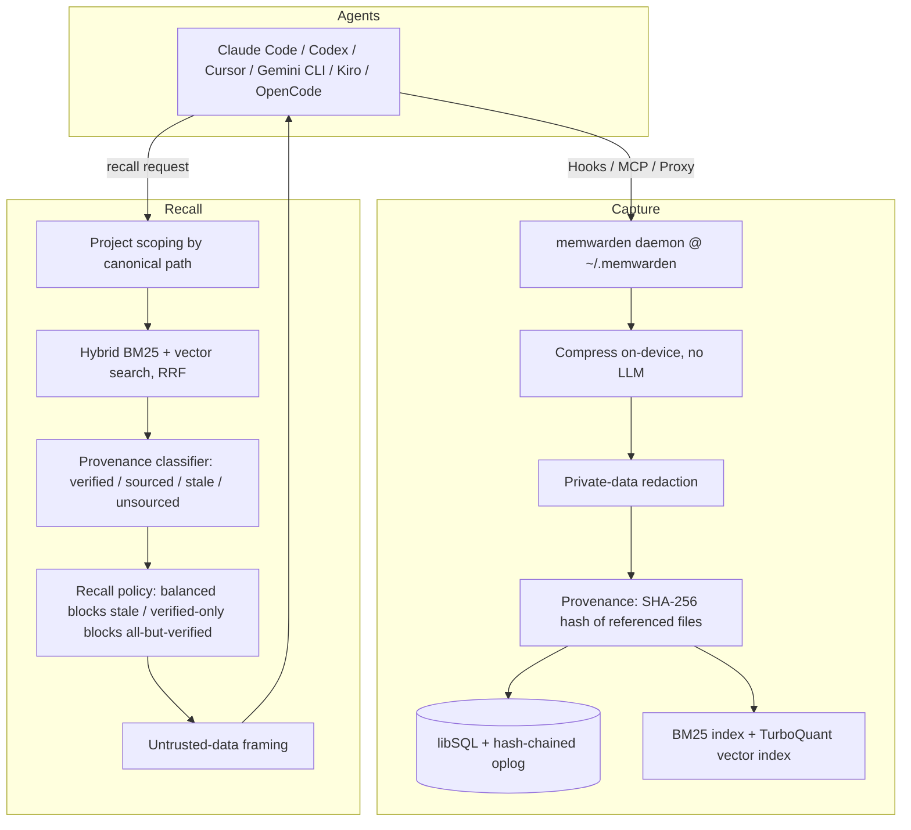

# Architecture & internals

## Data flow



## The pipeline, step by step

1. **Capture.** `observe` compresses raw tool output into a compact record (no LLM call), redacts
   private data, and hashes the source files it references. Session journals ride the same path:
   your prompts are stored as first-class intent (title = what you asked, secret-redacted,
   length-capped), and session end synthesizes a deterministic handoff summary from the session's
   observations.
2. **Embed and compress.** text → `all-MiniLM-L6-v2` vector → **TurboQuant** 2/4-bit codes
   (Google's quantization algorithm, [arXiv:2504.19874](https://arxiv.org/abs/2504.19874),
   implemented from scratch in pure TypeScript).
3. **Store and chain.** Every write lands in the SHA-256 hash-chained oplog, so the store is
   tamper-evident and `memory_verify` can confirm the chain is intact.
4. **Verified recall.** Hybrid BM25 + vector search (RRF), scoped to your project by canonical
   path (symlinks and path spellings resolved, so recall never silently misses), firewalled so
   stale memory never reaches the model, packed under a token budget. Contradictions are surfaced
   by `doctor` as advisories - recall never silently drops a true memory.

## Tamper-evidence and erasure, in full

Every write lands in an append-only, SHA-256 hash-chained oplog. `memory_verify` walks the chain
and recomputes every hash, so an **edit or a reorder** of any past entry breaks the chain at the
first touched entry.

It is **tamper-evident, not tamper-proof.** There is no signing. The chain detects edits and
reorders, but it does **not** detect tail-truncation - dropping the newest entries leaves a
shorter, still-valid chain.

**Deletion comes with a receipt - and an honest scope.** `memwarden forget <id>` removes a memory
from the active store, search, recall, and every index, and prints a receipt citing the oplog
entries that recorded the original write and the deletion, plus whole-chain verification. An
unknown id reports failure honestly; there is no `{deleted: 0, success: true}` theater here.

**Erasure without breaking the chain - and only *authorized* erasure.** Oplog entries commit to
the SHA-256 *of* their content (chain v2), not the content itself - so the content can be nulled in
place and every hash still verifies. Every erasure is itself chain-recorded: the store appends an
`erase` entry listing exactly which entry ids (and their content hashes) were nulled, and
verification **rejects any nulled payload that no later `erase`/`compact` record vouches for**.
`memwarden forget <id> --erase` deletes the memory AND erases its content from the oplog; the
receipt says `contentErased: true` (with the title redacted) and you can grep the database file
yourself to confirm the bytes are gone (SQLite `secure_delete` is on, and the WAL is checkpointed).

**Erase cascades into derived records.** An observation's content also flows into records *derived*
from it: the session's `firstPrompt`, the session-end handoff (`Session.summary`, the stored
summary, the searchable handoff observation), and Déjà Fix capsules recorded from it. `--erase`
re-derives all of those from the remaining observations - as if the erased one never existed - and
byte-erases their stale history too (each rewrite is chain-authorized). It is source-preserving,
idempotent, and convergent, not atomic: a mid-cascade failure never deletes the source, may leave
derived records partially re-derived (the failure message says so), and a retry converges. After
the cascade a residual scan checks the session's remaining records for the erased content; a
surviving copy flips `contentErased` to false and names the residual. Precisely scoped: the
cascade covers session-derived records and Déjà Fix capsules; it does **not** rewrite *other
independent observations* that quote the same text (forget them by id).

`memwarden compact [--dry-run]` erases every *already-forgotten* memory in one pass, migrates any
pre-v2 history to the new chain, anchors the old chain's head hash in a final `compact` record, and
VACUUMs the file. Live memories are never touched.

The remaining honest limits: erasure cannot reach copies *outside* the store - filesystem
snapshots, backups, `memwarden export` files you made earlier, or bytes an SSD's wear-leveling
retired. Receipts issued before a compaction cite pre-compaction entry hashes; the compact record's
`previousHeadHash` (plus each receipt's `chainHead`) anchors which chain they belong to. The
nuke-it-all path is `memwarden down --all --data`.

## Source layout

```
src/kernel/      in-process runtime: function registry, trigger dispatch, pubsub, HTTP
src/state/       StateKV, memory + libSQL stores, append-only hash-chained oplog
src/functions/   observe / search (BM25 + TurboQuant vector + RRF) / doctor / conflicts / dejafix / context / forget+erase
src/functions/verify.ts  Verified Recall: content-hash provenance -> verified / sourced_unverified / stale / unsourced
src/functions/injection-format.ts  the one untrusted-data formatter every injection surface routes through
src/functions/paths.ts   canonical project/cwd scoping (recall never silently misses)
src/embedding/   on-device embedding provider (transformers.js, optional)
src/mcp/         dependency-free MCP server (stdio JSON-RPC) + the recall prompt
src/proxy/       OpenAI-compatible memory gateway (for model endpoints you control)
src/daemon/      ensure (self-heal on use) + service (self-heal on crash/reboot)
src/cli/         up / down / status / connect / doctor / audit / forget / compact / exclude / dejafix / hooks / export / import
src/cli/tools.ts per-tool MCP adapters: Claude Code, Codex, Cursor, Kiro, Antigravity, OpenCode, OpenClaw
src/cli/host-hooks.ts  native lifecycle-hook adapters: Claude Code, Codex, Cursor, Gemini CLI, Kiro, OpenCode
src/bundle/      portable Brain Bundle export & import
benchmark/       reproducible recall benchmark
eval/            firewall eval corpus (npm run eval, 8 gates, CI-gated at 100%)
test/            602 tests: kernel, store parity, oplog, erase + compact, quantizer, MCP,
                 proxy, tool-wiring, Verified Recall, Déjà Fix, foreign-store audit,
                 delete receipts, injection controls + containment, conflict audit,
                 HTTP security (auth/host/content-type), path scoping, self-heal,
                 cross-tool reliability harness, e2e
```
