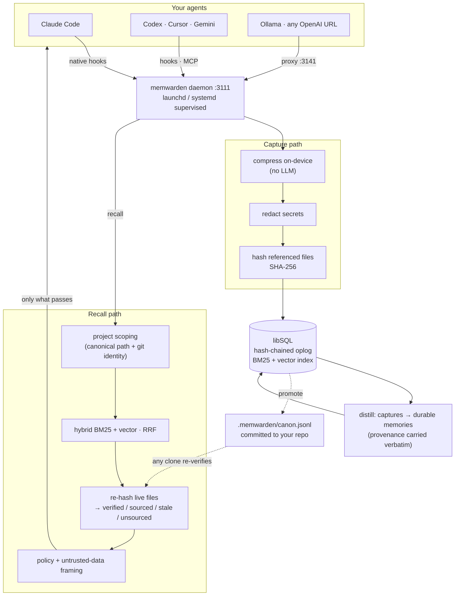

# Introducing memwarden: your agent's memory is lying to you

*First public beta. A memory firewall for AI coding agents — local-first, self-custodied, and honest about what it can and cannot prove.*

---

## The failure that hurts isn't forgetting

Every coding agent now ships memory. Claude Code, Cursor, Codex, Gemini — they all remember something across sessions, and a healthy ecosystem of memory layers has grown around them. The pitch is always the same: your agent forgets, so store more.

But forgetting is not the failure mode that costs you an afternoon.

Here is the one that does. Three weeks ago your agent recorded a decision: *refresh tokens rotate every 15 minutes, enforced in `src/auth.ts`*. Correct at the time. Last week someone moved to 60 minutes. The file changed. The memory did not.

Today your agent reads that memory, believes it completely, and writes code against a policy that no longer exists. It is not hallucinating — it is faithfully recalling something that used to be true. You will find the bug three files later, and you will not suspect memory, because memory is supposed to be the reliable part.

This is *confidently wrong recall*, and it is structural. A memory layer that stores everything and trusts everything will inject stale facts with exactly the same confidence as fresh ones, because it has no way to tell them apart. OWASP added Memory Poisoning to its 2026 Agentic Top 10 (ASI06) for the adversarial version of this; the accidental version happens to everyone, every day, quietly.

memwarden flips the default: **memory is untrusted until its source still checks out.**

---

## An origin story we'd rather not tell

Before the architecture, the thing that earned us the right to talk about honesty.

While preparing this release we ran `memwarden status` against a real install — six weeks of daily use across Claude Code, Cursor, and Codex:

```
memory    15771 observations, 0 memories, 99 sessions, 11643 vectors
```

Fifteen thousand captures. **Zero memories.**

The distillation step that turns raw captures into durable memory was missing from the published build. Worse, the retention sweep was running perfectly: every code-backed capture older than thirty days was being deleted on schedule, because nothing checked whether anything durable had been distilled from it first.

We had built a memory layer that was a sieve. It captured diligently, then quietly threw the knowledge away. And our own status command printed `0 memories` next to `15771 observations` for weeks without ever flagging it as broken, because a number nobody can interpret is not honesty.

Both are fixed in this release, and both left permanent marks on the design:

1. **The durability contract**: code-backed knowledge is *distilled*, never dropped. At the retention horizon, a capture carrying file provenance is promoted into a durable memory — keeping its content and its capture-time hashes — rather than deleted. Only captures with no provenance at all (nothing to verify against) age out. As a side effect, sweep-versus-distill ordering stopped mattering: whichever runs first, knowledge survives.
2. **`status` diagnoses itself.** It now says *"16,177 captures but 0 distilled memories — distillation is not running"* and tells you what to run.

We are telling you this because it is the single best evidence for the thesis. A memory layer whose correctness nobody can check will be wrong, and you will not find out. Ours was wrong. We found out because the system is designed to be checkable, and we are shipping the check.

---

## What memwarden is

One local daemon. One brain at `~/.memwarden`. Every coding agent you use points at it — Claude Code, Codex, Cursor, Gemini CLI, Kiro, OpenCode, Grok CLI, and anything speaking MCP or an OpenAI-compatible API.

```bash
npm install -g memwarden && memwarden up
```

That is the whole setup. No cloud, no account, no API key. Your memory lives on your disk in a file you can copy.

The part that matters: **every code-backed memory stores the SHA-256 hash of each file it referenced at capture time.** On recall, memwarden re-hashes those files in your live repo. If a hash no longer matches, that memory is *blocked before the model ever sees it*.

Every memory that survives is labeled for exactly what it is:

| State | Meaning | What the firewall does |
| --- | --- | --- |
| 🟢 `verified` | a capture-time file hash still matches disk | **injected** — the only state that earns this |
| 🔵 `sourced` | has a source (a command, files present but unhashable), no content hash to re-check | injected, **labeled** |
| 🟠 `stale` | a referenced file changed or vanished since capture | **blocked** |
| ⚪ `unsourced` | no provenance at all | kept for explicit lookups, **labeled** |

Two policies. `balanced` (default) blocks stale and labels the rest — it means *"not detected stale,"* not *"proven safe."* `verified-only` raises the floor so only hash-verified memory is ever auto-injected, for hostile-repo threat models.

---

## Architecture



Three ways memory reaches a tool, because hosts genuinely differ: **native hooks** where the host supports them (capture and recall happen automatically, no instruction files), **MCP** for explicit tool calls, and an **OpenAI-compatible proxy** for everything else. `memwarden status` shows *detected / configured / live* per tool, so "it works across your tools" is a claim you can check rather than trust.

### Capture

Hooks fire on tool use, prompts, and session end. memwarden compresses the raw tool output **without an LLM** (deterministic extraction — no second model, no API cost, no new failure mode), redacts secrets, extracts which files were involved, and hashes each one. Everything is scoped by canonical path plus git identity, so two worktrees of the same repo share memory while unrelated projects never leak into each other.

### Storage

libSQL (SQLite) at `~/.memwarden`, mode 0700, database 0600. Every mutation also appends to a **hash-chained oplog**: each entry commits to the previous entry's hash, so the history is tamper-evident and `memory_verify` recomputes the whole chain on demand.

Deletion produces a **receipt**: the create and delete entry hashes, the chain head, and an offline-checkable receipt hash. `memwarden forget --erase` and `memwarden compact` actually scrub content from the oplog and re-chain from genesis, and our demo proves it by byte-scanning the database file for the erased text.

Honest limit, since this is exactly where security claims get inflated: it is **tamper-evident, not tamper-proof.** A local attacker who can rewrite the entire database can recompute a consistent chain. What the chain gives you is detection of partial tampering and a verifiable record for your own audit — not defense against an adversary with full write access to your disk.

### Recall

Hybrid retrieval: BM25 lexical plus on-device vector search (all-MiniLM-L6-v2, 384 dimensions, downloaded once, never leaves your machine), fused with Reciprocal Rank Fusion. Results are scoped to the current project, then **every hit is classified against the live repo** before the policy decides what may be injected.

What passes is wrapped as explicitly untrusted data, with embedded delimiters defanged so stored text cannot break out of its frame and issue instructions. Recalled memory is *data the model reads*, never *instructions the model follows*.

---

## The part that's new: portable proof

Here is the limitation we shipped this release to fix.

A hash chain proves something only on the machine that made it. Your verified memory was verified *for you*. A teammate cloning the repo, your own second laptop, CI — all started from an empty brain and re-learned what the team already knew. Every memory layer has this cold-start problem, and the usual answer is a hosted service with a shared bucket: now your memory lives in someone else's cloud, and unrelated agents writing into one shared store make recall noisy fast.

memwarden takes the other path. **Promote the memory into the repo, and let every checkout verify it for itself.**

```bash
memwarden canon push      # → .memwarden/canon.jsonl   (commit it)
memwarden canon verify    # re-hash it against THIS checkout
memwarden canon pull      # load what still holds into this machine's brain
```

`.memwarden/canon.jsonl` is one JSON record per line — newline-delimited so git diffs it per memory and merges it like code. Each record carries repo-relative paths and the capture-time SHA-256 of every file it depends on. That is the entire trick: **any clone can re-hash those files and reach its own verdict, with no daemon, no account, and no vendor in the loop.**

Watch it work across machines:

```console
$ memwarden canon verify            # the machine that captured it
  VERIFIED      1 memories still hold against this checkout
  STALE         0 reference code that changed or vanished

$ memwarden canon verify            # a teammate's clone, different path, same code
  VERIFIED      1 memories still hold against this checkout

# someone changes the rotation policy from 15m to 60m
$ memwarden canon verify
  VERIFIED      0 memories still hold against this checkout
  STALE         1 reference code that changed or vanished

  [stale]  Refresh-token rotation is 15 minutes
           drifted: src/auth.ts

$ memwarden canon verify --strict ; echo $?
1                                   # your CI just blocked the PR
```

Three consequences worth naming:

- **Cold start collapses.** Clone the repo, run `canon pull`, and your agent starts with the team's verified decisions instead of nothing.
- **Review comes free.** A promoted memory shows up in a pull request like a migration file. Bad memories get caught by a human before they enter the canon. You do not need us to build a review workflow; git already has one.
- **Trust stays yours.** The canon is a text file in your repo. If you delete memwarden tomorrow, your team's memory is still there, still checkable with `sha256sum`.

The details that decide whether this survives contact with a real team:

- **A secret gate with no override.** Memory content is compressed tool output, and tool output includes `cat .env` and stack traces with connection strings. `canon push` scans for private key blocks, cloud and provider API keys, JWTs and credentialed connection strings, and **blocks** those records. There is deliberately no bypass flag, because git history is a one-way door — `--all` relaxes the staleness rule only.
- **Reformatting is not a lie.** Records carry a second, whitespace-normalized hash, so `verify` distinguishes *unchanged*, *reformatted* (the code didn't change, the bytes moved), and *drifted*. `--strict` fails CI on real drift, never on Prettier. A gate that cries wolf gets deleted in week two.
- **Canon can be maintained, not just created.** `push` promotes from your local brain, and brains are per-machine — so without a repair path, the first big refactor rots the canon permanently and the original author may have left the team. `canon reanchor` re-hashes drifted records against your checkout and records **who asserted** they still hold. `verify` reports those as attested rather than proven, so a human claim is never dressed up as capture-time evidence.
- **`pull` is not silent.** A canon is attacker-reachable: anyone who can land a commit can add records your agents will read. `pull` loads only records that hold locally, refuses unverifiable ones outright, shows you what it would ingest, and requires `--yes`. The generated `.memwarden/README.md` asks you to put `.memwarden/` in `CODEOWNERS`, which is the real protection.
- **Byte-stable output**, so an unchanged brain re-pushes an identical file and a diff always means something real.

None of that was in the first draft. It exists because we had the design torn apart before shipping it, and the reviewer was right about all of it.

---

## What else is in the box

**Déjà Fix.** An error-and-fix pair learned in one agent surfaces in another — but only while the files it depends on still hash-match. It is the highest-frequency moment where cross-agent memory obviously beats per-tool memory: Cursor solves it at 2pm, Claude Code hits the same stack trace at 5pm and already knows.

**`memwarden doctor .`** grades the memory of the project you are standing in — red, yellow, green, with the reason each memory got its verdict. `memwarden why <id>` explains one verdict in full.

**`npx memwarden audit <store>`** grades *someone else's* memory store — claude-mem, a pile of `CLAUDE.md` files, a Mem0 export — with no install and no daemon. It is the cheapest way to find out whether the memory you already have is telling your agents the truth.

**An 8-gate firewall eval** runs in CI on every commit: stale refusal, fresh retention, project isolation, label accuracy, handoff trust, verified-only policy, and injection containment. It gates our own releases. We are explicit that it is *self-referential* — we wrote the tests for the gates we wrote — which is why an externally-runnable trust benchmark is on the roadmap and this number is not offered as proof of superiority.

**Portability.** `memwarden export` / `import` moves your brain between machines as a single Brain Bundle. `memwarden down --all` reverses every config change it ever made.

**A daemon that isn't a bad neighbour.** The same install that exposed the sieve bug had also grown to 846MB, and 95% of the database turned out to be the oplog storing a second full copy of every value, forever. Tamper-evidence needs the hash *chain*, not the payloads — so `memwarden compact --prune-history` drops superseded payload copies while keeping each entry's content hash. Measured on that real install: payloads 316.7MB → 112MB, 158,177 of 193,298 entries pruned, **222MB reclaimed**, and `/memwarden/verify` still returns `verified: true` across all 193,298 entries. `status` now prints the footprint so this is visible rather than a surprise.

---

## How this differs from the memory layers you already know

The field is crowded and some of it is genuinely excellent. Star counts and versions below were checked on 2026-08-24; the interesting column is the third one.

| | Scale | Storage | Verifies memory against source code? |
| --- | --- | --- | --- |
| **claude-mem** | ~92K stars | local SQLite | No trust surface — sessions are LLM-compressed and re-injected |
| **Mem0** | ~64K stars | OSS + hosted platform | No. Relevance and recency, not source verification |
| **agentmemory** | ~27K stars | local markdown + semantic search | Partly — its verify is confidence-scored provenance, not file-hash re-checking |
| **Hindsight** (Vectorize) | ~21K stars, MIT | Postgres + pgvector (server) | No — and its docs say so plainly |
| **memwarden** | this one | local libSQL, no server | **Yes — SHA-256 per referenced file, re-hashed at recall** |

Hindsight deserves specifics, because it is the most serious engineering in this space and the closest thing to a competing answer. Its retrieval stack is frankly better than ours: four parallel strategies (semantic, BM25, graph traversal, temporal), a cross-encoder reranker, entity resolution, and LLM-consolidated observations with proof counts. If you want the most sophisticated *retrieval*, look there.

But on the question this post is about, its own documentation is unambiguous. When a memory is *"no longer true"*, the guidance is to invalidate it manually, because — quoting their docs — **"Nothing in the pipeline knows the world changed, so you tell it explicitly."** Their `stale` signal is not divergence from your code; it grades how many retained memories are still waiting to be consolidated *inside Hindsight*. Their layer hierarchy calls raw facts "ground truth," where ground truth means *what the system was told*. Contradictions are reconciled by an LLM writing a narrative ("Alice works at Meta (previously thought to work at Google)") within one retrieval window — non-deterministic, and not a bank-wide sweep.

Their multi-agent story is worth reading too, because they are refreshingly blunt about its edge: memory banks are the hard boundary, and inside a bank there is no trust boundary between agents. Their words: **"A filter you can forget to pass is not isolation… Tags are organization, not isolation… A single retain without the tag leaks."**

So the honest summary of the difference is narrow and specific: **everyone else reconciles memories against each other; memwarden checks memory against your code.** That is one axis, not a claim of general superiority.

### Where the others beat us, plainly

- **Published retrieval benchmarks.** Mem0 reports 92.5% on LoCoMo and 94.4% on LongMemEval. agentmemory grew on reproducible benchmark scores. We have not run LongMemEval or LoCoMo, and until we do we will not claim retrieval superiority over anyone.
- **Retrieval sophistication.** Hindsight's graph traversal plus cross-encoder reranking is a deeper stack than our BM25 + vector + RRF.
- **Users, polish, and ecosystem.** claude-mem has roughly 90× our star count and a much more travelled onboarding path.
- **Our eval is self-referential.** Our 8 gates are tests we wrote for behavior we designed. They gate our releases honestly; they are not third-party evidence, and an externally-runnable trust benchmark is on the roadmap precisely because of that gap.

## What memwarden does *not* prove

The most important section here, and the one most likely to be quoted back at us.

**A matching hash proves the source is unchanged. It does not prove the memory is correct.** A memory recorded mid-migration — *"we use JWT auth"* — captured against a file that has not changed since is hash-verified and wrong. Freshness is one axis of trust, not all of it. The honest triad is *freshness* (mechanical, shipped), *utility* (did this memory actually help — empirical, not shipped yet), and *authorship* (which agent and model wrote this — partially shipped via capture attestation). We narrow the failure mode that silently misleads agents. We do not adjudicate truth.

**Reformatting is drift.** Run Prettier across a file and every memory about it goes stale, even though every one is still true. Today that is a false positive you have to refresh past. Content-normalized hashing and finer-grained anchoring are the obvious next step, and we would rather say so than pretend the current behavior is ideal.

**No network effect, and that is deliberate.** Local-first forecloses one. Value grows with your own corpus and, linearly, with your team's committed canon — it behaves like `.editorconfig`, not like a marketplace. Anyone claiming Metcalfe's law for a local memory tool is selling something.

**Windows service supervision is not done.** The daemon runs for your login session and self-heals on next use; rerun `memwarden up` after a reboot.

**Encryption at rest is not implemented.** Your brain is protected by filesystem permissions (0700/0600) and a loopback-only, secret-authenticated HTTP surface with a Host-header firewall. A process running as you can read it.

The full list lives in [docs/limitations.md](../docs/limitations.md), and we keep it current because a limitations page nobody updates is marketing.

---

## Try it in thirty seconds

Start with the diagnosis — it needs no install and no daemon, and it works on the memory you already have:

```bash
npx memwarden audit ~/.claude-mem        # or a CLAUDE.md, or a Mem0 export
```

If the report is greener than you feared, good. If it is not, that is the whole argument, made with your own data.

Then, if you want the firewall in the loop:

```bash
npm install -g memwarden
memwarden up
```

```bash
memwarden status                  # daemon, storage, per-tool detected/configured/live
memwarden doctor .                # trust audit of this project
memwarden canon push              # promote verified memory into your repo
```

This is a **first public beta**. It is Apache-2.0, it has 729 tests and an 8-gate firewall eval in CI, and it has one embarrassing bug fixed in this very release that we chose to write about instead of quietly patching. Issues and pull requests are genuinely welcome — the fleet-mode work (shared verified memory and a conflict firewall for swarms of parallel agents) is planned in the open, issue by issue.

**Your agent's memory is lying to you. Prove yours isn't.**

*github.com/saiyam1814/memwarden · a [Kubesimplify](https://kubesimplify.com) project*
